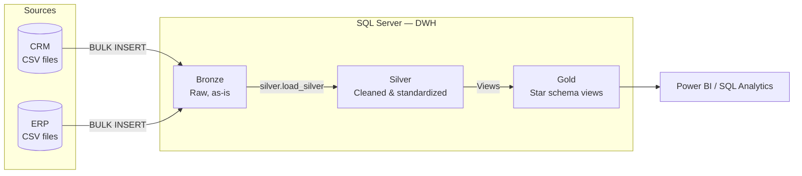

# SQL-Data-Warehouse-Project
Build a data warehouse form scratch using Medallion structure ( Bronze Layer, Silver Layer, and Gold Layer)

# Modern SQL Data Warehouse — Medallion Architecture (SQL Server)


An end-to-end data warehouse built from scratch in **SQL Server**, integrating two operational source systems (**CRM** and **ERP**) into a single, analytics-ready **star schema**. The pipeline follows the **Medallion Architecture** (Bronze → Silver → Gold), with stored-procedure-based ETL, embedded data-quality rules, validation test suites, and a business-facing data catalog.

> **Business problem:** Customer, product, and sales data live in two disconnected systems with inconsistent keys, codes, and formats. Analysts cannot answer simple questions, such as *"Who are our top customers by country?"*, *"Which product lines drive revenue?"* without manual reconciliation.
> **Solution:** A layered warehouse that ingests, cleans, integrates, and models this data into a single source of truth for BI and ad-hoc SQL.

---

## Table of Contents

1. [Architecture](#architecture)
2. [Data Sources](#data-sources)
3. [Layer Design](#layer-design)
4. [Key Transformations & Data-Quality Rules](#key-transformations--data-quality-rules)
5. [Gold Layer — Star Schema](#gold-layer--star-schema)
6. [Data Quality Testing](#data-quality-testing)
7. [Getting Started](#getting-started)
8. [Repository Structure](#repository-structure)
9. [Design Decisions & Trade-offs](#design-decisions--trade-offs)
10. [Roadmap](#roadmap)
11. [Author](#author)

---

## Architecture




| Principle | Implementation |
|---|---|
| Separation of concerns | One schema per layer (`bronze`, `silver`, `gold`) in a single `DWH` database |
| Repeatable loads | Full-refresh pattern: `TRUNCATE` + `INSERT`, safe to re-run |
| Observability | Per-table and per-batch load durations logged via `PRINT`; `TRY/CATCH` error reporting |
| Business usability | Gold layer exposes friendly column names and surrogate keys |

---

## Data Sources

| System | File | Description | Rows (approx.) |
|---|---|---|---|
| CRM | `cust_info.csv` | Customer master (name, marital status, gender, create date) | ~18.5K |
| CRM | `prd_info.csv` | Product master with cost, product line, validity dates (history) | ~400 |
| CRM | `sales_details.csv` | Sales transactions (orders, dates, quantity, price, amount) | ~60.4K |
| ERP | `CUST_AZ12.csv` | Customer demographics (birth date, gender) | ~18.5K |
| ERP | `LOC_A101.csv` | Customer location (country) | ~18.5K |
| ERP | `PX_CAT_G1V2.csv` | Product category, subcategory, maintenance flag | ~37 |

Integration map between the two systems:


---

## Layer Design

| Layer | Object Type | Load Method | Transformations | Audience |
|---|---|---|---|---|
| **Bronze** | Tables | `BULK INSERT` via `bronze.load_bronze` (full load) | None — raw copy of source | Data engineers (traceability, debugging) |
| **Silver** | Tables | `INSERT … SELECT` via `silver.load_silver` (full load) | Cleansing, standardization, deduplication, derived columns, data enrichment | Data engineers & analysts |
| **Gold** | Views | Virtual (computed on read) | Integration across systems, business naming, surrogate keys, star schema | BI users, analysts, decision makers |

---

## Key Transformations & Data-Quality Rules

The Silver layer is where most of the engineering effort lives. Highlights:

**Customers (CRM)**
- Deduplication on `cst_id` using `ROW_NUMBER() OVER (PARTITION BY cst_id ORDER BY cst_create_date DESC)` — keeps the most recent record.
- Removal of rows with a missing primary key.
- Trimming of leading/trailing spaces on names and keys.
- Code normalization: `M/S` → `Married/Single`, `M/F` → `Male/Female`, unknowns → `n/a`.

**Products (CRM)**
- Derivation of `cat_id` from the composite `prd_key` to enable the join to the ERP category table.
- Null cost handling (`ISNULL(prd_cost, 0)`).
- Product line decoding (`R/S/T/M` → `Road / Other Sales / Touring / Mountain`).
- **Slowly-changing history repair:** `prd_end_dt` is recalculated with `LEAD()` as the day before the next version's start date, eliminating overlapping validity windows.

**Sales (CRM)**
- Integer dates (`YYYYMMDD`) converted to `DATE`; invalid values (zero or wrong length) set to `NULL`.
- Business-rule enforcement: **`sales = quantity × price`**. Missing, negative, or inconsistent sales are recomputed; missing or invalid prices are derived from sales ÷ quantity.

**ERP tables**
- Key alignment with CRM (strip `NAS` prefix, remove dashes) so customers match across systems.
- Future birth dates nullified.
- Country code standardization (`DE` → `Germany`, `US/USA` → `United States`, blanks → `n/a`).

---

## Gold Layer — Star Schema


| Object | Type | Grain | Description |
|---|---|---|---|
| `gold.dim_customers` | Dimension | One row per customer | CRM customer data enriched with ERP demographics and country. CRM is the master source for gender; ERP fills gaps. |
| `gold.dim_products` | Dimension | One row per **active** product | CRM product data enriched with ERP category/subcategory. Historical versions excluded (`prd_end_dt IS NULL`). |
| `gold.fact_sales` | Fact | One row per order line | Sales measures (amount, quantity, price) and dates, linked to dimensions via surrogate keys. |

Full column-level definitions, lineage, and business rules are documented in the **[Data Catalog](docs/DWH%20Data%20Catalog.md)**.


## Data Quality Testing

Validation scripts in [`/tests`](tests) are run after each load. Every check is written so that **an empty result set = pass**.

| Layer | Checks |
|---|---|
| **Silver** | Primary-key uniqueness and nulls · unwanted spaces · standardized value domains · invalid date ranges (start > end, order > ship/due) · `sales = quantity × price` consistency · orphan records between sales, customers and products |
| **Gold** | Surrogate-key uniqueness in dimensions · valid gender domain · product/category lookup coverage · **referential integrity** of `fact_sales` against both dimensions (no orphan facts) |

---

## Getting Started

### Prerequisites
- **SQL Server** 2019+ (Express or Developer edition is sufficient)
- **SSMS** or Azure Data Studio
- Git

### Installation

```bash
git clone https://github.com/OssFad/SQL-Data-Warehouse-Project.git
```

> ⚠️ **Before loading:** update the CSV file paths inside `scripts/Bronze Layer/proc_Load_bronze data.sql` to match the location of the `datasets/` folder on your machine. The SQL Server service account must have read access to that folder.

### Execution Order

| Step | Script | Action |
|---|---|---|
| 1 | `scripts/init_database_DWH.sql` | Creates the `DWH` database and the three schemas ⚠️ *drops the database if it exists* |
| 2 | `scripts/Bronze Layer/DDL bronze dwh.sql` | Creates Bronze tables |
| 3 | `scripts/Bronze Layer/proc_Load_bronze data.sql` | Creates the load procedure → run `EXEC bronze.load_bronze;` |
| 4 | `scripts/Silver Lyer/DDL silver dwh.sql` | Creates Silver tables |
| 5 | `scripts/Silver Lyer/proc_load_silver_dwh.sql` | Creates the transform procedure → run `EXEC silver.load_silver;` |
| 6 | `scripts/Gold Layer/DDL gold dwh.sql` | Creates the star-schema views |
| 7 | `tests/*.sql` | Runs data-quality validations |

---

## Repository Structure

```
SQL-Data-Warehouse-Project/
├── datasets/
│   ├── CRM/                      # cust_info, prd_info, sales_details
│   └── ERP/                      # CUST_AZ12, LOC_A101, PX_CAT_G1V2
├── docs/
│   ├── DWH Data Catalog.md       # Gold-layer business & technical catalog
│   ├── DWH Data Flow.png         # End-to-end data lineage
│   ├── DWH Data Integration.png  # CRM ↔ ERP relationship map
│   └── DWH Data Model.png        # Star schema
├── scripts/
│   ├── init_database_DWH.sql     # Database & schema setup
│   ├── Bronze Layer/             # Raw tables + bulk-load procedure
│   ├── Silver Lyer/              # Cleansed tables + transform procedure
│   └── Gold Layer/               # Dimension & fact views
├── tests/                        # Silver & Gold quality checks
├── LICENSE
└── README.md
```

---

## Design Decisions & Trade-offs

| Decision | Rationale | Trade-off |
|---|---|---|
| **Full refresh** instead of incremental loads | Source volumes are small (~116K rows); simplicity and idempotency outweigh load-time savings | Would not scale to large or high-frequency sources without CDC / watermarking |
| **Gold as views**, not tables | Always in sync with Silver, zero extra storage, easy to iterate on business logic | Query cost paid at read time; materialization would be needed at scale |
| **Surrogate keys via `ROW_NUMBER()`** | Decouples the model from source-system keys | Keys are not stable across rebuilds — acceptable for views, not for persisted history |
| **SCD Type 1 (current state only)** in `dim_products` | Reporting scope targets current catalog | Historical product attributes are not available for point-in-time analysis |
| **CRM as master** for customer gender | CRM is the system of record; ERP used only as fallback | Requires business sign-off in a real engagement |


## License

This project is licensed under the [MIT License](LICENSE).
